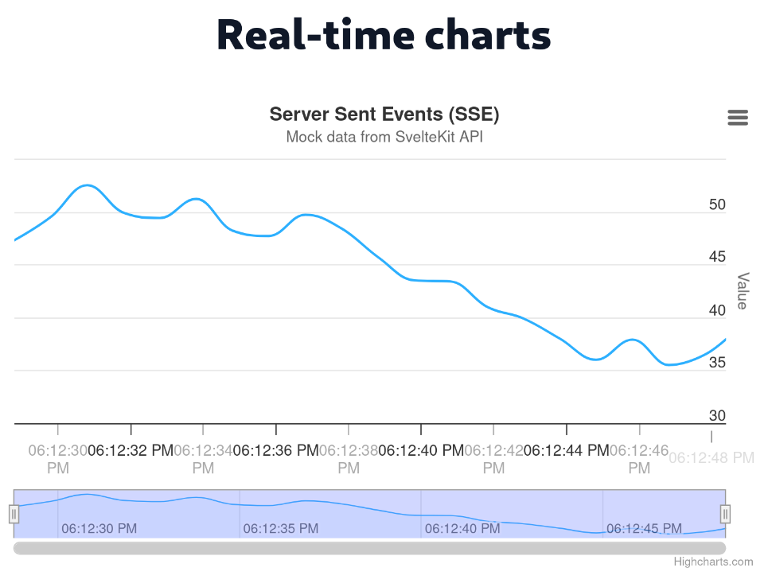

# Real-time charts with SvelteKit and Highcharts

This is a SvelteKit project that uses Highcharts to create real-time charts with mock data from a Server Sent Events (SSE) endpoint with SvelteKit.



## Tech Stack

- SvelteKit
- Highcharts
- TailwindCSS

## Developing

Once you've created a project and installed dependencies with `pnpm install`, start a development server:

```bash
pnpm run dev

# or start the server and open the app in a new browser tab
pnpm run dev -- --open
```

## Building

To create a production version of your app:

```bash
pnpm run build
```

You can preview the production build with `pnpm run preview`.

> To deploy your app, you may need to install an [adapter](https://svelte.dev/docs/kit/adapters) for your target environment.
